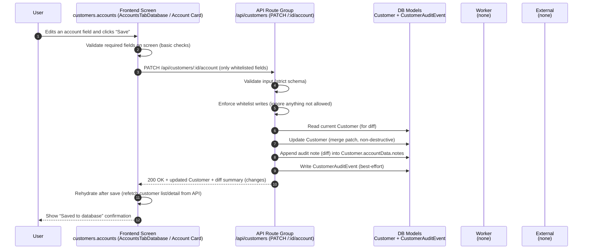

# Flow 01 — Account details save (customer account patch)

## Inputs
- **Customer ID** (`:id`)
- **Whitelisted patch fields** (e.g. selected scalar fields + selected `accountData.*` paths)
- **Authenticated actor identity** (for audit attribution)

## Outputs
- Updated **`Customer`**
- New **audit note** inside `Customer.accountData.notes` (diff text)
- New **`CustomerAuditEvent`** (best-effort)
- UI refreshed from DB (rehydrated)

## Non-negotiable rules
- **DB is the source of truth**: after save, UI must refresh from API/DB.
- **Whitelist writes only**: never accept arbitrary fields.
- **No destructive overwrites**: missing keys must not delete existing DB values.
- **Audit logging required**: capture actor + timestamp + field diff where applicable.

## Failure cases
- Validation fails (bad field / wrong shape) → show error; do not write.
- Not authenticated / actor identity missing → reject write (no unaudited saves).
- DB conflict or unexpected error → show error; UI must not assume save happened.
