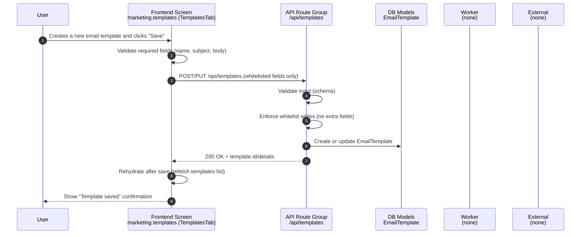

# Flow 03 — Template create

## Inputs
- Template fields (name, subject, body)
- Customer context (template is customer-scoped in DB)

## Outputs
- New/updated **`EmailTemplate`**
- UI refreshed from DB (rehydrated)

## Non-negotiable rules
- **Whitelist writes only**: only allow known template fields.
- **Rehydrate after save**: refetch the templates list from API/DB.
- **No destructive overwrites**: partial updates must not wipe unrelated fields.

## Failure cases
- Validation error (missing required fields) → show error; no DB write.
- DB error → show error; do not assume it saved.
