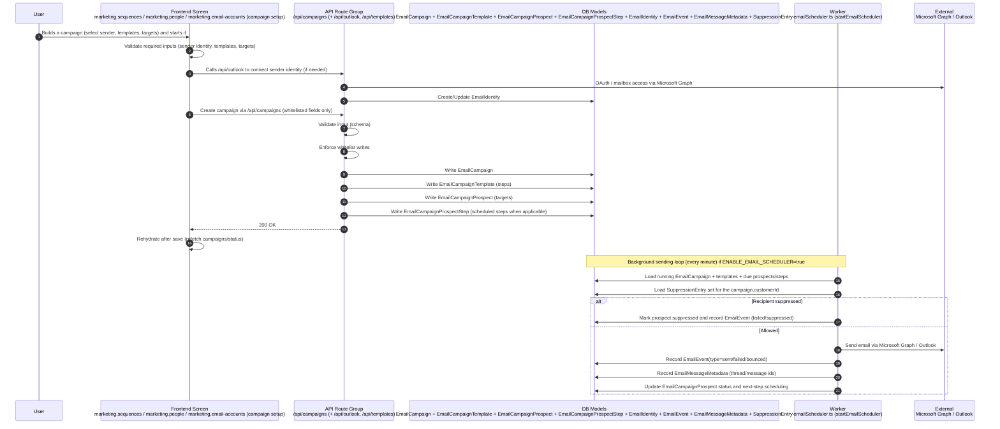

# Flow 04 — Campaign create and send

## Inputs
- Campaign configuration (customerId, sender identity, templates, targeting list)
- Suppression list entries (customer-scoped)
- Worker enabled flag: `ENABLE_EMAIL_SCHEDULER=true`

## Outputs
- Persisted campaign data:
  - **`EmailCampaign`**
  - **`EmailCampaignTemplate`**
  - **`EmailCampaignProspect`**
  - **`EmailCampaignProspectStep`** (where used)
  - **`EmailIdentity`**
- Sending telemetry:
  - **`EmailEvent`**
  - **`EmailMessageMetadata`**
- Emails delivered via **Microsoft Graph / Outlook**

## Non-negotiable rules
- **Whitelist writes only** on `/api/campaigns` and related setup endpoints.
- **Rehydrate after save**: UI must refetch campaign state from API/DB.
- **Suppression enforcement is mandatory** at send-time (customer-scoped).
- **Idempotency/claiming**: worker must prevent double-sends in multi-instance environments.

## Failure cases
- OAuth/Outlook connection fails → cannot send; show error and retry.
- Validation fails on campaign create → do not write campaign rows.
- Worker disabled (`ENABLE_EMAIL_SCHEDULER!=true`) → campaign may exist but will not send.
- External send fails → record failure/bounce event; do not pretend it was sent.
