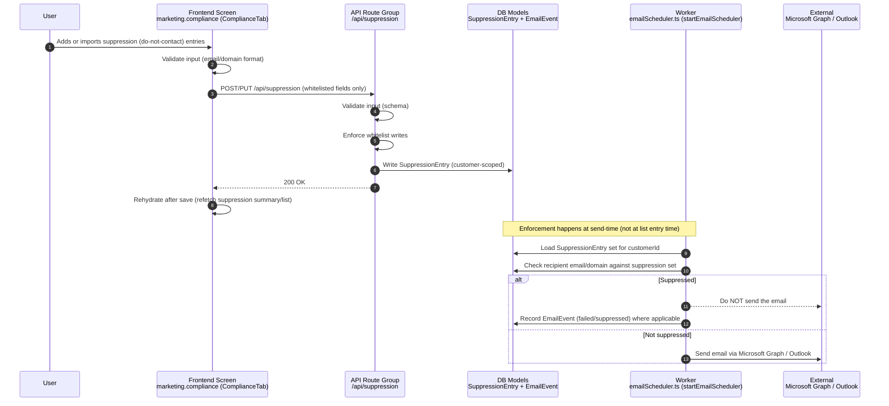

# Flow 06 — Suppression enforcement (DNC)

## Inputs
- Suppression entries (email and/or domain), customer-scoped
- Outbound send attempts (campaign/sequence execution)

## Outputs
- Updated **`SuppressionEntry`** set
- Suppressed sends prevented (no external email)
- Optional telemetry: **`EmailEvent`** for suppressed/failed sends

## Non-negotiable rules
- **Suppression enforcement is mandatory** for all outbound sending.
- **Customer-scoped enforcement**: never leak suppression data across customers.
- **Whitelist writes only**: only allow expected suppression fields.
- **Rehydrate after save**: UI must refetch suppression state after changes.

## Failure cases
- Invalid entry format → reject with error.
- Worker disabled (`ENABLE_EMAIL_SCHEDULER!=true`) → enforcement won’t run because sending won’t run.
- Enforcement regression → highest severity; may cause compliance incidents.
