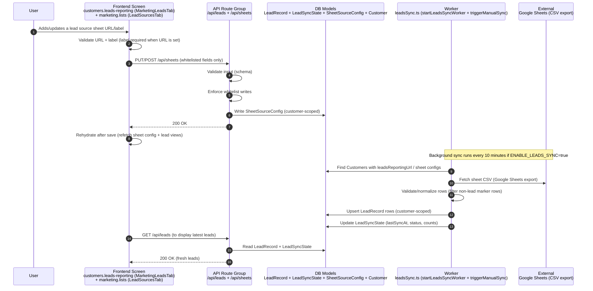

# Flow 07 — Leads sync from Google Sheets

## Inputs
- Google Sheet URL + label (customer-scoped)
- Worker enabled flag: `ENABLE_LEADS_SYNC=true`

## Outputs
- **`SheetSourceConfig`** updated
- Leads stored as **`LeadRecord`**
- Sync tracking in **`LeadSyncState`**
- UI refreshed from DB (rehydrated)

## Non-negotiable rules
- **Whitelist writes only** for sheet config and lead write operations.
- **No destructive overwrites**: new sync must not delete unrelated lead data unless explicitly designed.
- **Customer-scoped writes**: all lead records and sync state must stay within a customer.
- **Rehydrate after save**: UI must refetch after config changes and after sync completes.

## Failure cases
- Sheet not public / not found / invalid format → sync fails; state recorded in LeadSyncState.
- Worker disabled (`ENABLE_LEADS_SYNC!=true`) → leads won’t auto-refresh from sheets.
- Large sheet / rate limits → partial or delayed sync; surface errors in diagnostics/logs.
