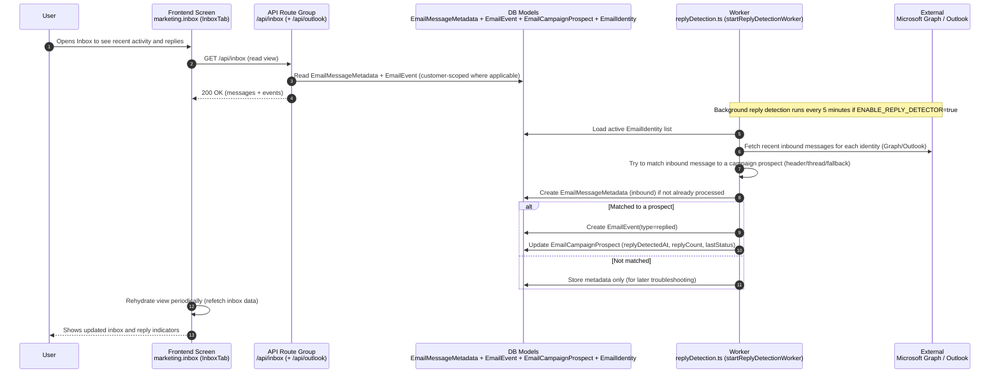

# Flow 08 — Inbox + reply detection

## Inputs
- Connected **Email identities** (Outlook)
- Worker enabled flag: `ENABLE_REPLY_DETECTOR=true`

## Outputs
- **`EmailMessageMetadata`** rows (inbound + linkage fields when found)
- **`EmailEvent`** rows for replies
- Updated **`EmailCampaignProspect`** status when a reply is detected

## Non-negotiable rules
- **Idempotency**: do not process the same provider message twice.
- **Customer scoping**: replies and metadata must associate correctly to customer/campaign context.
- **Rehydrate after save**: Inbox UI must refresh from API/DB to show latest events.

## Failure cases
- Graph/Outlook API failures → replies not detected; must log errors and retry next interval.
- Matching fails → replies may be stored but not linked; requires troubleshooting.
- Worker disabled (`ENABLE_REPLY_DETECTOR!=true`) → inbox shows stale/missing reply detection.
