# ODCRM Visual System Map (Repo-Accurate, Single Source of Truth)
Last updated: 2026-02-16  
Scope: **Documentation only** (generated from repository scan results provided as ground truth)

---

## SECTION 0 — Purpose + Legend

### Purpose
This document is the **single source of truth** for the current ODCRM architecture. It maps:
- **Frontend screens** (top-level tabs + key sub-screens)
- **API route groups + standalone endpoints** (as mounted in `server/src/index.ts`)
- **Database models** (all Prisma models in `server/prisma/schema.prisma`)
- **Background workers** (wired + present-but-unwired)
- **External integrations**
- **Trigger flows** across the system

### Legend (terms used in diagrams)
- **Actor**: A human or system initiating actions (e.g. CRM user, admin)
- **Screen**: A frontend page/tab/view the user navigates to (top-level or sub-screen)
- **Route Group**: An Express router mounted at a prefix (e.g. `/api/customers`)
- **Standalone Endpoint**: An Express handler mounted directly (e.g. `GET /api/version`)
- **Model**: A Prisma model/table (e.g. `Customer`, `EmailCampaign`)
- **Worker**: Background job/cron process (wired or present-but-unwired)
- **External Integration**: Non-ODCRM system (e.g. Microsoft Graph/Outlook, Google Sheets)

### Multi-tenant / ownership context (Customer-scoped)
- **Primary tenant boundary** is **Customer** (`Customer.id`), with many records keyed by `customerId`.
- API routes frequently operate in a **customer-scoped** manner (explicit `:id`, `:customerId`, or payload/customer selection).
- Workers generally process records **partitioned by customerId** (e.g., suppression sets, campaigns, lead sync).

### Architecture rules (current operating constraints)
- **DB is the only source of truth**: UI must treat API/DB as canonical for business data.
- **Frontend rehydrates after save**: after successful writes, refresh from API (do not rely on local-only state).
- **No destructive overwrites**: missing keys in payloads must **not** delete existing DB keys unless explicitly designed as delete.
- **Strict whitelist payloads for writes**: do not spread arbitrary request bodies into Prisma writes.
- **Audit log on account/customer changes**: field changes should be attributable (actor + timestamp) and capture diffs where implemented.
- **Change management**: every feature that adds/changes routes/models/workers/screens must update this map and coverage section.

---

## SECTION 1 — Whole-system wiring diagram (Mermaid flowchart)

```mermaid
flowchart LR

%% ============================================================================
%% Actors
%% ============================================================================
subgraph ACTORS[Actors]
  A1[CRM User]
  A2[Admin / Operator]
end

%% ============================================================================
%% Frontend (React)
%% ============================================================================
subgraph FE[Frontend (React SPA)]
  FE_App[src/App.tsx\nTop-level tab shell + URL sync]

  %% Top-level tabs (nav contract + App)
  FE_Dash[dashboards-home\nDashboardsHomePage]
  FE_Cust[customers-home\nCustomersHomePage]
  FE_Mkt[marketing-home\nMarketingHomePage]
  FE_Onb[onboarding-home\nOnboardingHomePage]
  FE_Set[settings-home\nSettingsHomePage]

  %% Customers sub-screens
  FE_Cust_Acc[customers.accounts\nAccountsTabDatabase]
  FE_Cust_Con[customers.contacts\nContactsTab]
  FE_Cust_Leads[customers.leads-reporting\nMarketingLeadsTab]

  %% Marketing sub-screens
  FE_Mkt_Overview[marketing.overview\nOverviewDashboard]
  FE_Mkt_Reports[marketing.reports\nReportsTab]
  FE_Mkt_People[marketing.people\nPeopleTab]
  FE_Mkt_Lists[marketing.lists\nLeadSourcesTab]
  FE_Mkt_Compliance[marketing.compliance\nComplianceTab]
  FE_Mkt_EmailAccts[marketing.email-accounts\nEmailAccountsTab]
  FE_Mkt_Templates[marketing.templates\nTemplatesTab]
  FE_Mkt_Sequences[marketing.sequences\nSequencesTab]
  FE_Mkt_Schedules[marketing.schedules\nSchedulesTab]
  FE_Mkt_Inbox[marketing.inbox\nInboxTab]

  %% Onboarding sub-screens
  FE_Onb_Overview[onboarding.overview\nOnboardingOverview]
  FE_Onb_Progress[onboarding.progress-tracker\nProgressTrackerTab]
  FE_Onb_Form[onboarding.customer-onboarding\nCustomerOnboardingTab]

  %% Settings sub-screens
  FE_Set_UserAuth[settings.user-authorization\nUserAuthorizationTab]

  %% Present in repo but not mounted in nav/app
  FE_Unmounted_Sales[SalesHomePage.tsx\n(present, not mounted)]
  FE_Unmounted_Ops[OperationsHomePage.tsx\n(present, not mounted)]
end

%% Navigation wiring
FE_App --> FE_Dash
FE_App --> FE_Cust
FE_App --> FE_Mkt
FE_App --> FE_Onb
FE_App --> FE_Set

FE_Cust --> FE_Cust_Acc
FE_Cust --> FE_Cust_Con
FE_Cust --> FE_Cust_Leads

FE_Mkt --> FE_Mkt_Overview
FE_Mkt --> FE_Mkt_Reports
FE_Mkt --> FE_Mkt_People
FE_Mkt --> FE_Mkt_Lists
FE_Mkt --> FE_Mkt_Compliance
FE_Mkt --> FE_Mkt_EmailAccts
FE_Mkt --> FE_Mkt_Templates
FE_Mkt --> FE_Mkt_Sequences
FE_Mkt --> FE_Mkt_Schedules
FE_Mkt --> FE_Mkt_Inbox

FE_Onb --> FE_Onb_Overview
FE_Onb --> FE_Onb_Progress
FE_Onb --> FE_Onb_Form

FE_Set --> FE_Set_UserAuth

%% ============================================================================
%% API (Express)
%% ============================================================================
subgraph API[API (Express on server/src/index.ts)]
  %% Standalone endpoints
  API_health[GET /health]
  API_api_health[GET /api/health]
  API_version[GET /api/version]
  API_routes[GET /api/routes\n(debug-only)]
  API_static_uploads[STATIC /uploads\n(legacy local filesystem)]

  %% Mounted route groups (distinct nodes)
  RG_campaigns[/api/campaigns\nroutes/campaigns.ts/]
  RG_contacts[/api/contacts\nroutes/contacts.ts/]
  RG_outlook[/api/outlook\nroutes/outlook.ts/]
  RG_email[/api/email\nroutes/tracking.ts/]
  RG_schedules[/api/schedules\nroutes/schedules.ts/]
  RG_reports[/api/reports\nroutes/reports.ts\n(mounted twice)/]
  RG_inbox[/api/inbox\nroutes/inbox.ts/]
  RG_lists[/api/lists\nroutes/lists.ts/]
  RG_sequences[/api/sequences\nroutes/sequences.ts/]
  RG_customers[/api/customers\nroutes/customers.ts/]
  RG_leads[/api/leads\nroutes/leads.ts/]
  RG_templates[/api/templates\nroutes/templates.ts/]
  RG_company_data[/api/company-data\nroutes/companyData.ts/]
  RG_admin[/api/admin\nroutes/admin.ts/]
  RG_job_sectors[/api/job-sectors\nroutes/jobSectors.ts/]
  RG_job_roles[/api/job-roles\nroutes/jobRoles.ts/]
  RG_places[/api/places\nroutes/places.ts/]
  RG_uploads[/api/uploads\nroutes/uploads.ts/]
  RG_suppression[/api/suppression\nroutes/suppression.ts/]
  RG_users[/api/users\nroutes/users.ts/]
  RG_user_prefs[/api/user-preferences\nroutes/userPreferences.ts/]
  RG_sheets[/api/sheets\nroutes/sheets.ts/]
  RG_diag[/api/_diag\nroutes/diag.ts/]
  RG_overview[/api/overview\nroutes/overview.ts/]
end

%% FE → API primary wiring (screen to relevant route groups)
A1 --> FE_App
A2 --> FE_App

FE_Dash --> RG_customers
FE_Dash --> RG_leads
FE_Dash --> RG_overview
FE_Dash --> RG_reports

FE_Cust_Acc --> RG_customers
FE_Cust_Acc --> RG_job_sectors
FE_Cust_Acc --> RG_job_roles
FE_Cust_Acc --> RG_places
FE_Cust_Acc --> RG_uploads
FE_Cust_Acc --> RG_company_data

FE_Cust_Con --> RG_contacts
FE_Cust_Con --> RG_customers

FE_Cust_Leads --> RG_leads
FE_Cust_Leads --> RG_customers
FE_Cust_Leads --> RG_sheets

FE_Mkt_Overview --> RG_overview
FE_Mkt_Reports --> RG_reports
FE_Mkt_People --> RG_contacts
FE_Mkt_People --> RG_lists
FE_Mkt_Lists --> RG_sheets
FE_Mkt_Lists --> RG_lists
FE_Mkt_Compliance --> RG_suppression
FE_Mkt_EmailAccts --> RG_outlook
FE_Mkt_EmailAccts --> RG_customers
FE_Mkt_Templates --> RG_templates
FE_Mkt_Sequences --> RG_sequences
FE_Mkt_Schedules --> RG_schedules
FE_Mkt_Inbox --> RG_inbox
FE_Mkt_Inbox --> RG_outlook

FE_Onb_Overview --> RG_customers
FE_Onb_Progress --> RG_customers
FE_Onb_Form --> RG_customers
FE_Onb_Form --> RG_company_data
FE_Onb_Form --> RG_sheets
FE_Onb_Form --> RG_uploads

FE_Set_UserAuth --> RG_users
FE_Set_UserAuth --> RG_admin
FE_Set_UserAuth --> RG_user_prefs

%% Standalone endpoint visibility (ops/debug)
A2 --> API_routes
A2 --> API_version
A2 --> API_api_health
A2 --> API_health

%% ============================================================================
%% Database (Azure PostgreSQL via Prisma)
%% ============================================================================
subgraph DB[Database (Azure PostgreSQL via Prisma)]
  subgraph DB_models[Prisma Models (grouped by domain)]
    subgraph DB_cust_gov[Customer & Governance]
      M_Customer[Customer]
      M_CustomerContact[CustomerContact]
      M_User[User]
      M_UserPreferences[UserPreferences]
      M_CustomerAuditEvent[CustomerAuditEvent]
      M_JobSector[JobSector]
      M_JobRole[JobRole]
    end

    subgraph DB_contacts_lists[Contacts & Lists]
      M_Contact[Contact]
      M_ContactList[ContactList]
      M_ContactListMember[ContactListMember]
      M_ContactSourceRow[ContactSourceRow]
    end

    subgraph DB_email_campaigns[Email Campaigns]
      M_EmailIdentity[EmailIdentity]
      M_EmailTemplate[EmailTemplate]
      M_EmailCampaign[EmailCampaign]
      M_EmailCampaignTemplate[EmailCampaignTemplate]
      M_EmailCampaignProspect[EmailCampaignProspect]
      M_EmailCampaignProspectStep[EmailCampaignProspectStep]
      M_EmailEvent[EmailEvent]
      M_EmailMessageMetadata[EmailMessageMetadata]
    end

    subgraph DB_sequences[Sequences]
      M_EmailSequence[EmailSequence]
      M_EmailSequenceStep[EmailSequenceStep]
      M_SequenceEnrollment[SequenceEnrollment]
    end

    subgraph DB_leads_sync[Leads & Sync]
      M_LeadRecord[LeadRecord]
      M_LeadSyncState[LeadSyncState]
      M_SheetSourceConfig[SheetSourceConfig]
    end

    subgraph DB_compliance[Compliance]
      M_SuppressionEntry[SuppressionEntry]
    end
  end
end

%% API route groups → DB models (high-level ownership wiring)
RG_customers --> M_Customer
RG_customers --> M_CustomerContact
RG_customers --> M_CustomerAuditEvent
RG_customers --> M_SheetSourceConfig
RG_customers --> M_LeadRecord
RG_customers --> M_LeadSyncState
RG_customers --> M_EmailIdentity

RG_contacts --> M_Contact
RG_contacts --> M_Customer

RG_campaigns --> M_EmailCampaign
RG_campaigns --> M_EmailCampaignTemplate
RG_campaigns --> M_EmailCampaignProspect
RG_campaigns --> M_EmailCampaignProspectStep
RG_campaigns --> M_EmailEvent

RG_templates --> M_EmailTemplate

RG_sequences --> M_EmailSequence
RG_sequences --> M_EmailSequenceStep
RG_sequences --> M_SequenceEnrollment

RG_inbox --> M_EmailMessageMetadata
RG_inbox --> M_EmailEvent

RG_email --> M_EmailEvent
RG_email --> M_EmailMessageMetadata

RG_schedules --> M_EmailCampaign
RG_schedules --> M_EmailIdentity

RG_lists --> M_ContactList
RG_lists --> M_ContactListMember
RG_lists --> M_ContactSourceRow
RG_lists --> M_Contact

RG_leads --> M_LeadRecord
RG_leads --> M_LeadSyncState
RG_leads --> M_Customer

RG_suppression --> M_SuppressionEntry

RG_users --> M_User
RG_user_prefs --> M_UserPreferences

RG_job_sectors --> M_JobSector
RG_job_roles --> M_JobRole

RG_sheets --> M_SheetSourceConfig
RG_company_data --> M_Customer

RG_overview --> M_Customer
RG_overview --> M_EmailCampaign
RG_overview --> M_LeadRecord

RG_reports --> M_EmailEvent
RG_reports --> M_LeadRecord

%% ============================================================================
%% Workers (cron/background)
%% ============================================================================
subgraph WORKERS[Workers (server/src/workers)]
  W_emailScheduler[emailScheduler.ts\nstartEmailScheduler\ncron: * * * * *\n(wired: ENABLE_EMAIL_SCHEDULER)]
  W_replyDetection[replyDetection.ts\nstartReplyDetectionWorker\ncron: */5 * * * *\n(wired: ENABLE_REPLY_DETECTOR)]
  W_leadsSync[leadsSync.ts\nstartLeadsSyncWorker\ncron: */10 * * * *\n(wired: ENABLE_LEADS_SYNC)\n+ triggerManualSync]

  W_aboutEnrichment[aboutEnrichment.ts\nstartAboutEnrichmentWorker\ncron: 0 2 * * *\n(present, not started)]
  W_campaignSender[campaignSender.ts\nrunCampaignSender\nprocessSequenceBasedCampaigns\n(present, not started)]
end

%% Workers → DB models
W_emailScheduler --> M_EmailCampaign
W_emailScheduler --> M_EmailCampaignProspect
W_emailScheduler --> M_EmailCampaignProspectStep
W_emailScheduler --> M_EmailEvent
W_emailScheduler --> M_SuppressionEntry
W_emailScheduler --> M_EmailIdentity

W_replyDetection --> M_EmailIdentity
W_replyDetection --> M_EmailMessageMetadata
W_replyDetection --> M_EmailCampaignProspect
W_replyDetection --> M_EmailEvent
W_replyDetection --> M_EmailCampaignProspectStep

W_leadsSync --> M_Customer
W_leadsSync --> M_LeadRecord
W_leadsSync --> M_LeadSyncState
W_leadsSync --> M_SheetSourceConfig

W_aboutEnrichment --> M_Customer

W_campaignSender --> M_EmailCampaign
W_campaignSender --> M_EmailCampaignProspect
W_campaignSender --> M_EmailEvent
W_campaignSender --> M_SuppressionEntry

%% ============================================================================
%% External integrations
%% ============================================================================
subgraph EXT[External Integrations]
  EXT_M365[Microsoft Graph / Outlook]
  EXT_GSheets[Google Sheets (CSV export)]
  EXT_Blob[Azure Blob Storage (uploads)]
  EXT_Places[Places provider (via /api/places)]
  EXT_Enrich[About enrichment provider (placeholder)\nused by aboutEnrichment + company-data]
end

RG_outlook --> EXT_M365
RG_inbox --> EXT_M365
W_replyDetection --> EXT_M365
W_emailScheduler --> EXT_M365

RG_sheets --> EXT_GSheets
W_leadsSync --> EXT_GSheets

RG_uploads --> EXT_Blob
RG_customers --> EXT_Blob

RG_places --> EXT_Places

RG_company_data --> EXT_Enrich
W_aboutEnrichment --> EXT_Enrich
```

---

## SECTION 2 — Trigger/behavior flows (Mermaid flowchart)

```mermaid
flowchart TB

%% ---------------------------------------------------------------------------
%% Campaign flow: templates → campaigns → prospects/steps → sender/scheduler → events
%% ---------------------------------------------------------------------------
subgraph F1[Campaign Flow]
  F1_UI[Marketing: templates/campaigns/sequences screens]
  F1_Templates[/api/templates/]
  F1_Campaigns[/api/campaigns/]
  F1_Sequences[/api/sequences/]
  F1_Customers[/api/customers/]
  F1_DB_T[EmailTemplate]
  F1_DB_C[EmailCampaign]
  F1_DB_CT[EmailCampaignTemplate]
  F1_DB_P[EmailCampaignProspect]
  F1_DB_PS[EmailCampaignProspectStep]
  F1_DB_E[EmailEvent]
  F1_DB_ID[EmailIdentity]
  F1_Worker[worker: emailScheduler.ts\n(startEmailScheduler)]
  F1_Ext[Microsoft Graph / Outlook]

  F1_UI --> F1_Templates --> F1_DB_T
  F1_UI --> F1_Campaigns --> F1_DB_C
  F1_Campaigns --> F1_DB_CT
  F1_Campaigns --> F1_DB_P
  F1_Campaigns --> F1_DB_PS
  F1_Customers --> F1_DB_ID
  F1_Worker --> F1_DB_C
  F1_Worker --> F1_DB_P
  F1_Worker --> F1_DB_PS
  F1_Worker --> F1_Ext
  F1_Worker --> F1_DB_E
end

%% ---------------------------------------------------------------------------
%% Sequence flow: EmailSequence → EmailSequenceStep → SequenceEnrollment → schedules/inbox/replies
%% ---------------------------------------------------------------------------
subgraph F2[Sequence Flow]
  F2_UI[Marketing: sequences screen]
  F2_Routes[/api/sequences/]
  F2_DB_S[EmailSequence]
  F2_DB_SS[EmailSequenceStep]
  F2_DB_EN[SequenceEnrollment]
  F2_Schedules[/api/schedules/]
  F2_Inbox[/api/inbox/]
  F2_ReplyW[worker: replyDetection.ts\n(startReplyDetectionWorker)]
  F2_DB_MM[EmailMessageMetadata]
  F2_DB_EV[EmailEvent]
  F2_Ext[Microsoft Graph / Outlook]

  F2_UI --> F2_Routes --> F2_DB_S
  F2_Routes --> F2_DB_SS
  F2_Routes --> F2_DB_EN
  F2_UI --> F2_Schedules
  F2_UI --> F2_Inbox
  F2_ReplyW --> F2_Ext
  F2_ReplyW --> F2_DB_MM
  F2_ReplyW --> F2_DB_EV
end

%% ---------------------------------------------------------------------------
%% Suppression/DNC flow: SuppressionEntry enforced at send/enroll/import
%% ---------------------------------------------------------------------------
subgraph F3[Suppression / DNC Flow]
  F3_UI[Marketing: suppression screen]
  F3_Route[/api/suppression/]
  F3_DB[SuppressionEntry]
  F3_Send[worker: emailScheduler.ts (send-time enforcement)]
  F3_Send2[worker: campaignSender.ts (present, not started)]

  F3_UI --> F3_Route --> F3_DB
  F3_Send --> F3_DB
  F3_Send2 --> F3_DB
end

%% ---------------------------------------------------------------------------
%% Leads sync flow: LeadRecord + LeadSyncState + leadsSync worker
%% ---------------------------------------------------------------------------
subgraph F4[Leads Sync Flow]
  F4_UI[Customers: leads-reporting\nMarketing: lead sources]
  F4_Customers[/api/customers/]
  F4_Leads[/api/leads/]
  F4_Sheets[/api/sheets/]
  F4_DB_LR[LeadRecord]
  F4_DB_LS[LeadSyncState]
  F4_DB_C[Customer]
  F4_DB_SSC[SheetSourceConfig]
  F4_Worker[worker: leadsSync.ts\n(startLeadsSyncWorker + triggerManualSync)]
  F4_Ext[Google Sheets (CSV export)]

  F4_UI --> F4_Leads --> F4_DB_LR
  F4_Leads --> F4_DB_LS
  F4_UI --> F4_Sheets --> F4_DB_SSC
  F4_Customers --> F4_DB_C
  F4_Worker --> F4_Ext
  F4_Worker --> F4_DB_C
  F4_Worker --> F4_DB_LR
  F4_Worker --> F4_DB_LS
end

%% ---------------------------------------------------------------------------
%% User/preferences/auth/admin flow: users + preferences + admin + diag/overview endpoints
%% ---------------------------------------------------------------------------
subgraph F5[User / Preferences / Admin / Diagnostics Flow]
  F5_UI[Settings: user-authorization\nTop-level app shell]
  F5_Users[/api/users/]
  F5_Prefs[/api/user-preferences/]
  F5_Admin[/api/admin/]
  F5_Diag[/api/_diag/]
  F5_Overview[/api/overview/]
  F5_Health[GET /api/health + GET /api/version + GET /api/routes]
  F5_DB_U[User]
  F5_DB_UP[UserPreferences]
  F5_DB_AE[CustomerAuditEvent]
  F5_Ext[Microsoft Identity (MSAL)\n+ Microsoft Graph / Outlook]

  F5_UI --> F5_Ext
  F5_UI --> F5_Users --> F5_DB_U
  F5_UI --> F5_Prefs --> F5_DB_UP
  F5_UI --> F5_Admin
  F5_Admin --> F5_DB_AE
  F5_UI --> F5_Diag
  F5_UI --> F5_Overview
  F5_UI --> F5_Health
end

%% ---------------------------------------------------------------------------
%% Onboarding/customer data: customers + company-data + sheets sources + uploads
%% ---------------------------------------------------------------------------
subgraph F6[Onboarding / Customer Data Flow]
  F6_UI[Onboarding: customer-onboarding]
  F6_Customers[/api/customers/]
  F6_Company[/api/company-data/]
  F6_Sheets[/api/sheets/]
  F6_Uploads[/api/uploads/]
  F6_DB_C[Customer]
  F6_DB_CC[CustomerContact]
  F6_DB_SSC[SheetSourceConfig]
  F6_DB_Audit[CustomerAuditEvent]
  F6_Ext_Blob[Azure Blob Storage]
  F6_Ext_Enrich[About enrichment provider (placeholder)]

  %% Write + audit + rehydrate concept
  F6_UI --> F6_Customers --> F6_DB_C
  F6_Customers --> F6_DB_CC
  F6_Customers --> F6_DB_Audit
  F6_UI --> F6_Company --> F6_DB_C
  F6_Company --> F6_Ext_Enrich
  F6_UI --> F6_Sheets --> F6_DB_SSC
  F6_UI --> F6_Uploads --> F6_Ext_Blob
end
```

---

## SECTION 2B — Write Paths (Authoritative Writes)

These are the **authoritative write paths** that materially change persisted state (DB rows and/or external storage).  
Use this section as a **decision tool** when adding/changing features: identify the screen, confirm the route group, confirm the models written, and confirm side effects + enforcement rules.

```mermaid
flowchart LR

%% Templates write path
subgraph WP1[Templates write path]
  WP1_S[Marketing.templates screen]
  WP1_R[/api/templates/]
  WP1_M[EmailTemplate]
  WP1_S --> WP1_R --> WP1_M
end

%% Campaigns write path (route-first; UI entrypoint may vary)
subgraph WP2[Campaigns write path]
  WP2_A[CRM User / API client]
  WP2_R[/api/campaigns/]
  WP2_M1[EmailCampaign]
  WP2_M2[EmailCampaignTemplate]
  WP2_M3[EmailCampaignProspect]
  WP2_M4[EmailCampaignProspectStep]

  %% Side effects
  WP2_W[worker: emailScheduler.ts\n(startEmailScheduler)]
  WP2_E1[EmailEvent]
  WP2_E2[EmailMessageMetadata]
  WP2_EXT[Microsoft Graph / Outlook]

  WP2_A --> WP2_R
  WP2_R --> WP2_M1
  WP2_R --> WP2_M2
  WP2_R --> WP2_M3
  WP2_R --> WP2_M4

  WP2_W --> WP2_E1
  WP2_W --> WP2_E2
  WP2_W --> WP2_EXT
end

%% Sequences write path
subgraph WP3[Sequences write path]
  WP3_S[Marketing.sequences screen]
  WP3_R[/api/sequences/]
  WP3_M1[EmailSequence]
  WP3_M2[EmailSequenceStep]
  WP3_M3[SequenceEnrollment]

  %% Side effects
  WP3_Sched[/api/schedules/]
  WP3_Inbox[/api/inbox/]
  WP3_ReplyW[worker: replyDetection.ts\n(startReplyDetectionWorker)]
  WP3_EXT[Microsoft Graph / Outlook]

  WP3_S --> WP3_R
  WP3_R --> WP3_M1
  WP3_R --> WP3_M2
  WP3_R --> WP3_M3

  WP3_S --> WP3_Sched
  WP3_S --> WP3_Inbox
  WP3_ReplyW --> WP3_EXT
end

%% Suppression write path
subgraph WP4[Suppression write path (DNC)]
  WP4_S[Marketing.compliance screen]
  WP4_R[/api/suppression/]
  WP4_M[SuppressionEntry]

  %% Side effects (enforcement)
  WP4_W1[worker: emailScheduler.ts\n(enforces suppression at send-time)]
  WP4_W2[worker: campaignSender.ts\n(present, not started)]

  WP4_S --> WP4_R --> WP4_M
  WP4_W1 --> WP4_M
  WP4_W2 --> WP4_M
end

%% Leads sync write path
subgraph WP5[Leads sync write path]
  WP5_S1[customers.leads-reporting screen]
  WP5_S2[marketing.lists screen]
  WP5_R1[/api/leads/]
  WP5_R2[/api/sheets/]
  WP5_M1[LeadRecord]
  WP5_M2[LeadSyncState]
  WP5_M3[SheetSourceConfig]

  %% Side effects
  WP5_W[worker: leadsSync.ts\n(startLeadsSyncWorker + triggerManualSync)]
  WP5_EXT[Google Sheets (CSV export)]

  WP5_S1 --> WP5_R1
  WP5_S2 --> WP5_R2

  WP5_R1 --> WP5_M1
  WP5_R1 --> WP5_M2
  WP5_R2 --> WP5_M3

  WP5_W --> WP5_EXT
end

%% Users/preferences write path
subgraph WP6[Users / preferences / admin write path]
  WP6_S[settings.user-authorization screen]
  WP6_R1[/api/users/]
  WP6_R2[/api/user-preferences/]
  WP6_R3[/api/admin/]
  WP6_M1[User]
  WP6_M2[UserPreferences]
  WP6_M3[CustomerAuditEvent]

  WP6_S --> WP6_R1 --> WP6_M1
  WP6_S --> WP6_R2 --> WP6_M2
  WP6_S --> WP6_R3 --> WP6_M3
end

%% Uploads write path
subgraph WP7[Uploads write path]
  WP7_S1[customers.accounts screen]
  WP7_S2[onboarding.customer-onboarding screen]
  WP7_R[/api/uploads/]
  WP7_EXT[Azure Blob Storage]
  WP7_LEG[STATIC /uploads\n(legacy local filesystem)]

  WP7_S1 --> WP7_R --> WP7_EXT
  WP7_S2 --> WP7_R --> WP7_EXT
end
```

---

## Enforcement Matrix (rules → checklist by domain)

Use this matrix when reviewing or adding features. A change is “done” only when the applicable rules are enforced for the domain touched.

Legend:
- ✅ = enforced by current architecture/flow
- ⚠️ = partially enforced / varies by route group / needs review when changing
- N/A = not applicable to this domain

| Domain | Rehydrate after save | Whitelist writes | Audit log | Suppression enforcement |
|---|---:|---:|---:|---:|
| **Customer & Governance** (`/api/customers`, `/api/users`, `/api/user-preferences`, `/api/admin`) | ✅ | ✅ | ✅ | N/A |
| **Contacts & Lists** (`/api/contacts`, `/api/lists`) | ✅ | ✅ | ⚠️ | N/A |
| **Email Campaigns** (`/api/campaigns`, `/api/templates`, `/api/email`, `/api/inbox`, `/api/outlook`) | ✅ | ✅ | ⚠️ | ✅ |
| **Sequences** (`/api/sequences`, `/api/schedules`, `/api/inbox`) | ✅ | ✅ | ⚠️ | ✅ *(send-time)* |
| **Leads & Sync** (`/api/leads`, `/api/sheets`, leadsSync worker) | ✅ | ✅ | ⚠️ | N/A |
| **Compliance** (`/api/suppression`) | ✅ | ✅ | ⚠️ | ✅ *(source of enforcement)* |
| **Uploads / Files** (`/api/uploads`, Azure Blob) | ✅ | ✅ | ⚠️ | N/A |

Notes:
- **Rehydrate after save**: UI must refetch from API/DB after successful writes; treat local state/cache as non-authoritative.
- **Whitelist writes**: Writes must use validated/whitelisted fields (never spread arbitrary payloads into Prisma writes).
- **Audit log**: Customer/account changes should be attributable; `CustomerAuditEvent` is the structured audit model.
- **Suppression enforcement**: Enforced at send-time by `emailScheduler.ts` (and would also apply to `campaignSender.ts` if wired later).

---

## SECTION 3 — Data ownership / ER map (Mermaid `erDiagram`)

> Note: Relationships below are derived where clearly indicated in the Prisma schema.  
> If you add/remove models or change relations, **update this ER map and the coverage report**.

```mermaid
erDiagram

  %% ==========================================================================
  %% Domain: Customer / Users
  %% ==========================================================================
  Customer ||--o{ Contact : has
  Customer ||--o{ CustomerContact : has
  Customer ||--o{ ContactList : has
  Customer ||--o{ ContactSourceRow : has
  Customer ||--o{ LeadRecord : has
  Customer ||--|| LeadSyncState : has
  Customer ||--o{ SuppressionEntry : has
  Customer ||--o{ EmailIdentity : has
  Customer ||--o{ EmailCampaign : has
  Customer ||--o{ EmailSequence : has
  Customer ||--o{ EmailTemplate : has
  Customer ||--o{ EmailEvent : has
  Customer ||--o{ SheetSourceConfig : has
  Customer ||--o{ CustomerAuditEvent : has

  User ||--|| UserPreferences : has

  %% ==========================================================================
  %% Domain: Contacts / Lists
  %% ==========================================================================
  ContactList ||--o{ ContactListMember : has
  Contact ||--o{ ContactListMember : member_of
  ContactList ||--o{ ContactSourceRow : sourced_by
  Contact ||--o{ ContactSourceRow : sourced_rows

  %% ==========================================================================
  %% Domain: Email (Identity / Campaign / Sequence / Tracking)
  %% ==========================================================================
  EmailIdentity ||--o{ EmailCampaign : sends_campaigns
  EmailIdentity ||--o{ EmailCampaignProspect : sends_to_prospects
  EmailIdentity ||--o{ EmailMessageMetadata : has_messages
  EmailIdentity ||--o{ EmailEvent : sent_events
  EmailIdentity ||--o{ EmailSequence : sends_sequences

  EmailCampaign ||--o{ EmailCampaignTemplate : has
  EmailCampaign ||--o{ EmailCampaignProspect : targets
  EmailCampaign ||--o{ EmailCampaignProspectStep : schedules
  EmailCampaign ||--o{ EmailEvent : produces

  EmailCampaignProspect ||--o{ EmailCampaignProspectStep : has_steps
  EmailCampaignProspect ||--o{ EmailEvent : produces
  EmailCampaignProspect ||--o{ EmailMessageMetadata : links_messages

  Contact ||--o{ EmailCampaignProspect : is_target

  %% ==========================================================================
  %% Domain: Sequences
  %% ==========================================================================
  EmailSequence ||--o{ EmailSequenceStep : has
  EmailSequence ||--o{ SequenceEnrollment : enrolls
  Contact ||--o{ SequenceEnrollment : enrolled

  %% ==========================================================================
  %% Domain: Leads / Sync
  %% ==========================================================================
  %% (LeadRecord + LeadSyncState are customer-scoped; explicit relations shown above)

  %% ==========================================================================
  %% Domain: Suppression
  %% ==========================================================================
  %% (SuppressionEntry is customer-scoped; explicit relation shown above)

  %% ==========================================================================
  %% Reference data
  %% ==========================================================================
  %% JobSector / JobRole are reference tables. (Places is an API route, not a Prisma model.)

  %% ==========================================================================
  %% Entities: include ALL Prisma models (even if relation is only implicit)
  %% ==========================================================================
  Customer {
    string id
  }
  Contact {
    string id
    string customerId
  }
  EmailIdentity {
    string id
    string customerId
  }
  EmailCampaign {
    string id
    string customerId
  }
  EmailCampaignTemplate {
    string id
    string campaignId
  }
  EmailTemplate {
    string id
    string customerId
  }
  EmailCampaignProspect {
    string id
    string campaignId
    string contactId
    string senderIdentityId
  }
  EmailCampaignProspectStep {
    string id
    string campaignId
    string campaignProspectId
  }
  EmailEvent {
    string id
    string customerId
    string campaignId
  }
  SuppressionEntry {
    string id
    string customerId
  }
  EmailMessageMetadata {
    string id
    string senderIdentityId
    string providerMessageId
  }
  CustomerContact {
    string id
    string customerId
  }
  ContactList {
    string id
    string customerId
  }
  ContactSourceRow {
    string id
    string customerId
    string contactId
    string listId
  }
  ContactListMember {
    string id
    string listId
    string contactId
  }
  EmailSequence {
    string id
    string customerId
    string senderIdentityId
  }
  EmailSequenceStep {
    string id
    string sequenceId
  }
  SequenceEnrollment {
    string id
    string sequenceId
    string contactId
  }
  LeadRecord {
    string id
    string customerId
  }
  LeadSyncState {
    string id
    string customerId
  }
  JobSector {
    string id
    string label
  }
  JobRole {
    string id
    string label
  }
  User {
    string id
    string email
  }
  UserPreferences {
    string id
    string userEmail
  }
  CustomerAuditEvent {
    string id
    string customerId
  }
  SheetSourceConfig {
    string id
    string customerId
  }
```



---

## SECTION 4 — Coverage validation (MANDATORY)

This coverage report is derived from the **ground truth scan lists** provided in the task prompt.

### Routes — Coverage checklist (Mapped: ✅)

#### Standalone endpoints (server/src/index.ts)
- `GET /health` — Mapped: ✅
- `GET /api/health` — Mapped: ✅
- `GET /api/version` — Mapped: ✅
- `GET /api/routes` (debug-only) — Mapped: ✅
- `STATIC /uploads` (legacy local filesystem) — Mapped: ✅

#### Mounted route groups (server/src/index.ts)
- `/api/campaigns` → `server/src/routes/campaigns.ts` — Mapped: ✅
- `/api/contacts` → `server/src/routes/contacts.ts` — Mapped: ✅
- `/api/outlook` → `server/src/routes/outlook.ts` — Mapped: ✅
- `/api/email` → `server/src/routes/tracking.ts` — Mapped: ✅
- `/api/schedules` → `server/src/routes/schedules.ts` — Mapped: ✅
- `/api/reports` → `server/src/routes/reports.ts` (mounted twice) — Mapped: ✅
- `/api/inbox` → `server/src/routes/inbox.ts` — Mapped: ✅
- `/api/lists` → `server/src/routes/lists.ts` — Mapped: ✅
- `/api/sequences` → `server/src/routes/sequences.ts` — Mapped: ✅
- `/api/customers` → `server/src/routes/customers.ts` — Mapped: ✅
- `/api/leads` → `server/src/routes/leads.ts` — Mapped: ✅
- `/api/templates` → `server/src/routes/templates.ts` — Mapped: ✅
- `/api/company-data` → `server/src/routes/companyData.ts` — Mapped: ✅
- `/api/admin` → `server/src/routes/admin.ts` — Mapped: ✅
- `/api/job-sectors` → `server/src/routes/jobSectors.ts` — Mapped: ✅
- `/api/job-roles` → `server/src/routes/jobRoles.ts` — Mapped: ✅
- `/api/places` → `server/src/routes/places.ts` — Mapped: ✅
- `/api/uploads` → `server/src/routes/uploads.ts` — Mapped: ✅
- `/api/suppression` → `server/src/routes/suppression.ts` — Mapped: ✅
- `/api/users` → `server/src/routes/users.ts` — Mapped: ✅
- `/api/user-preferences` → `server/src/routes/userPreferences.ts` — Mapped: ✅
- `/api/sheets` → `server/src/routes/sheets.ts` — Mapped: ✅
- `/api/_diag` → `server/src/routes/diag.ts` — Mapped: ✅
- `/api/overview` → `server/src/routes/overview.ts` — Mapped: ✅

### Models — Coverage checklist (Mapped: ✅)
- `Customer` — Mapped: ✅
- `Contact` — Mapped: ✅
- `EmailIdentity` — Mapped: ✅
- `EmailCampaign` — Mapped: ✅
- `EmailCampaignTemplate` — Mapped: ✅
- `EmailTemplate` — Mapped: ✅
- `EmailCampaignProspect` — Mapped: ✅
- `EmailCampaignProspectStep` — Mapped: ✅
- `EmailEvent` — Mapped: ✅
- `SuppressionEntry` — Mapped: ✅
- `EmailMessageMetadata` — Mapped: ✅
- `CustomerContact` — Mapped: ✅
- `ContactList` — Mapped: ✅
- `ContactSourceRow` — Mapped: ✅
- `ContactListMember` — Mapped: ✅
- `EmailSequence` — Mapped: ✅
- `EmailSequenceStep` — Mapped: ✅
- `SequenceEnrollment` — Mapped: ✅
- `LeadRecord` — Mapped: ✅
- `LeadSyncState` — Mapped: ✅
- `JobSector` — Mapped: ✅
- `JobRole` — Mapped: ✅
- `User` — Mapped: ✅
- `UserPreferences` — Mapped: ✅
- `CustomerAuditEvent` — Mapped: ✅
- `SheetSourceConfig` — Mapped: ✅

### Workers — Coverage checklist (wired/unwired + Mapped: ✅)
- `emailScheduler.ts` (wired when `ENABLE_EMAIL_SCHEDULER=true`) — Mapped: ✅
- `replyDetection.ts` (wired when `ENABLE_REPLY_DETECTOR=true`) — Mapped: ✅
- `leadsSync.ts` (wired when `ENABLE_LEADS_SYNC=true`; includes `triggerManualSync`) — Mapped: ✅
- `aboutEnrichment.ts` (**present, not started**) — Mapped: ✅
- `campaignSender.ts` (**present, not started**) — Mapped: ✅

### Screens — Coverage checklist (Mapped: ✅)

#### Top-level screens (nav/app mounted)
- `dashboards-home` → `DashboardsHomePage` — Mapped: ✅
- `customers-home` → `CustomersHomePage` — Mapped: ✅
- `marketing-home` → `MarketingHomePage` — Mapped: ✅
- `onboarding-home` → `OnboardingHomePage` — Mapped: ✅
- `settings-home` → `SettingsHomePage` — Mapped: ✅

#### Customers sub-screens
- `accounts` (`AccountsTabDatabase`) — Mapped: ✅
- `contacts` (`ContactsTab`) — Mapped: ✅
- `leads-reporting` (`MarketingLeadsTab`) — Mapped: ✅

#### Marketing sub-screens
- `overview` — Mapped: ✅
- `reports` — Mapped: ✅
- `people` — Mapped: ✅
- `lists` — Mapped: ✅
- `compliance` — Mapped: ✅
- `email-accounts` — Mapped: ✅
- `templates` — Mapped: ✅
- `sequences` — Mapped: ✅
- `schedules` — Mapped: ✅
- `inbox` — Mapped: ✅

#### Onboarding sub-screens
- `overview` — Mapped: ✅
- `progress-tracker` — Mapped: ✅
- `customer-onboarding` (only when customer selected) — Mapped: ✅

#### Settings sub-screens
- `user-authorization` — Mapped: ✅

#### Present in repo but NOT mounted in nav/app
- `OperationsHomePage.tsx` — Mapped: ✅ (present, not mounted)
- `SalesHomePage.tsx` — Mapped: ✅ (present, not mounted)

---

## SECTION 5 — Known issues / inconsistencies (from scan)

- **`/api/reports` mounted twice** in `server/src/index.ts`  
  Risk: confusing routing, duplicated middleware execution, harder debugging.

- **Workers present but not wired**  
  - `server/src/workers/aboutEnrichment.ts` (`startAboutEnrichmentWorker`) exists but is **not started** in `server/src/index.ts`.  
  - `server/src/workers/campaignSender.ts` (`runCampaignSender`, `processSequenceBasedCampaigns`) exists but is **not started** in `server/src/index.ts`.

- **Repo contains tabs that are not mounted in app/nav**  
  - `OperationsHomePage.tsx`, `SalesHomePage.tsx` are present but **not reachable** via `src/contracts/nav.ts` + `src/App.tsx`.  
  Possible causes: feature gating, incomplete nav wiring, or postponed modules.

